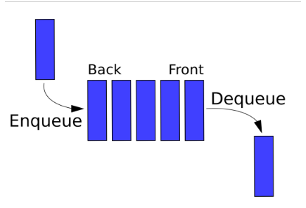

## 🔵 Queue

🍊Queue는 다음과 같은 성질을 갖는 추상자료형이다. (Queue단어 자체가 표 같은 것을 구매하기 위해 줄 서는 것을 이야기한다.)  
 🍊buffer로 많이 사용된다. (순서대로 처리해야하는 작업을 임시로 저장해두는 것)

- 데이터를 집어넣을 수 있는 linear 자료형이다.
- 먼저 집어넣은 데이터가 먼저 나온다. -> FIFO(First In First Out)
- enqueue : 데이터를 집어넣는 작업
- dequeue : 데이터를 추출하는 작업
- front : 데이터가 나가는 위치 (가장 앞)
- back : 데이터가 들어오는 위치 (가장 뒤)

