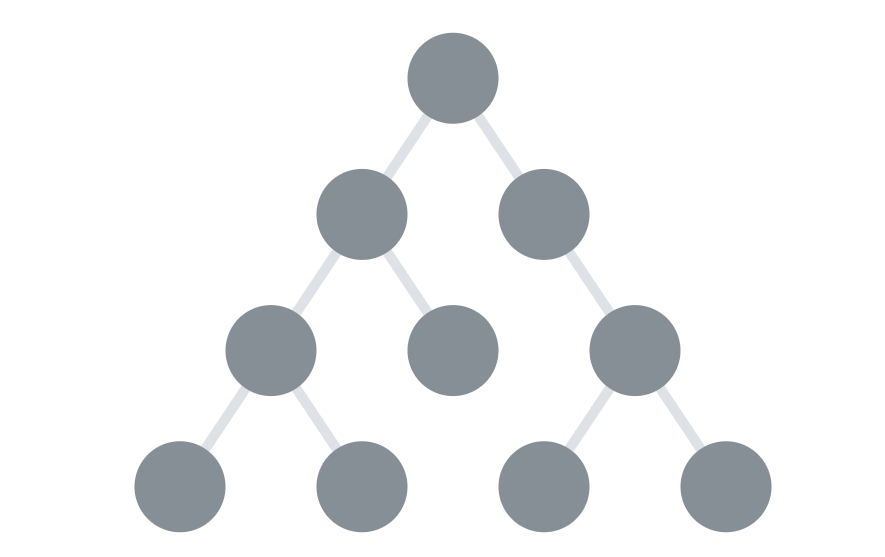

## 🔵 Tree

🍊 여러 데이터가 계층 구조 안에서 서로 연결된 형태를 나타낼 때 사용된다.

🍊 tree에 사용되는 용어모음

- node : 트리 안에 들어있는 각 항목
- child node : 한 node가 가지고 있는 하위 node들
- parent node : 노드 A가 B를 자식으로 가지고 있다면, node A는 node B의 부모노드라고 한다.
- root node : 트리의 가장 상층부에 있는 노드
- leaf node : 자식 노드가 없는 노드
- ancestor node : 노드A가 자식을 따라 내려가다가 노드 B에 도달할 수 있다면, 노드 A는 노드 B에 대해 조상노드라고 부른다.
- descendant node : 조상노드의 역
- sibling node : 같은 부모 노드를 갖는 다른 노드를 보고 형제 노드라고 한다.
