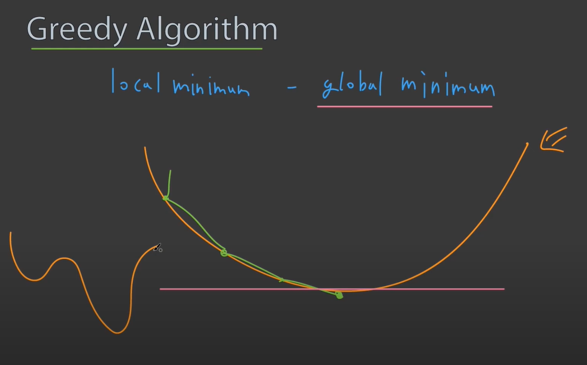
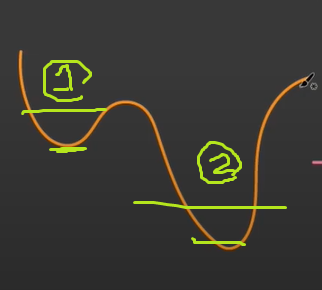

# Greedy Algorthims

- 미래를 생각하지 않고 각 단계에서 가장 최선의 선택을 하는 기법
- 각 단계에서 최선의 선택을 한 것이 전체적으로도 최선이길 바라는 알고리즘이다.
- local minimum vs global minimum
  
  위에서 큰 그래프처럼 greedy 알고리즘은 한 점에서 그 당시의 최적의 root로 해를 구해 나가는데  
     
  구한 해가 과연 최소값의 해인지 아니면 해당 지역에서만의 해인지는 판별할 수 없다는 것이다. -> 다른 알고리즘을 사용해야한다.

### 따라서 greedy 알고리즘의 핵심은 해를 도출할 결과의 root가 하나인가 아닌가를 처음 출발할 때 부터 판별한 후 하나라면 사용하는 것이다.

### 예시

- 동전바꾸기
- [10, 100, 500] 원으로 710원을 환전할때

```js
let n = 710;
let ten, hun, fhun;
fhun = parseInt(n / 500);
n %= 500;
hun = parseInt(n / 100);
n %= 100;
ten = parseInt(n / 10);
console.log(ten, hun, fhun);
```

### 반례

- 동전바꾸기
- [10, 30, 40, 50] 원으로 70원을 환전할때 최소 동전개수로 환전하기  
  greedy 알고리즘대로면 최적의 루트로 큰것부터 작은것으로50원 1개 10원2개 즉 3개를 해로 찾으나, 실질적인 해답은 30원과 40원 1개씩 쓰는 2개가 정답이다.
  이를 해결하기 위해선 D.P (dynamic programming)알고리즘을 사용해야한다.
