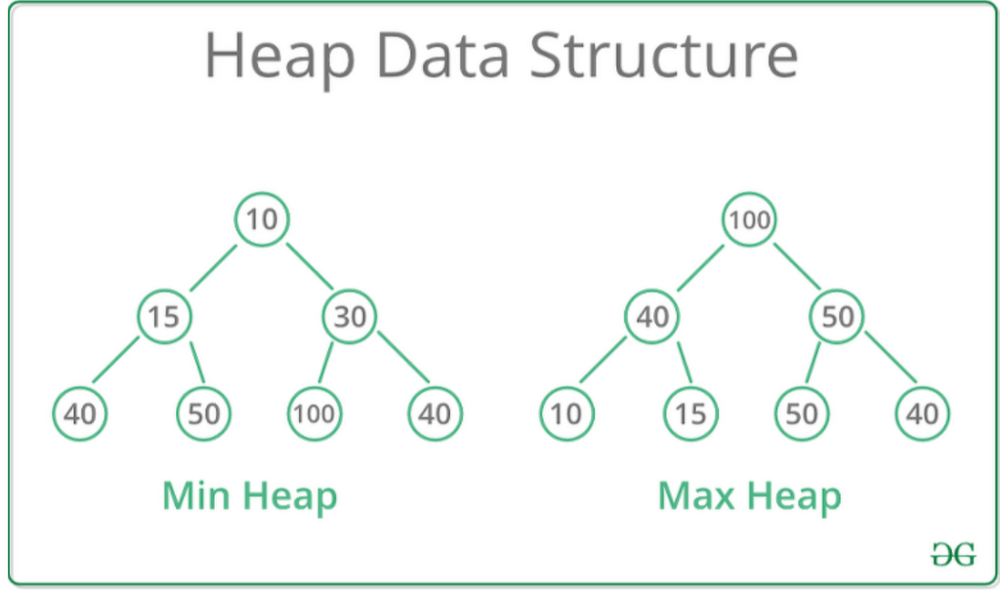
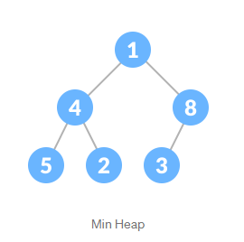
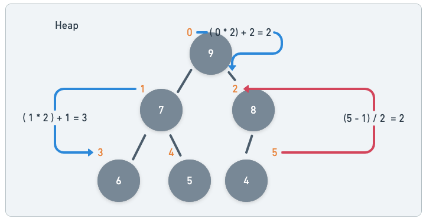
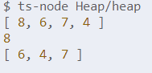

# 🔵 Heap

🍊 데이터에서 최대값과 최소값을 빠르게 찾기 위해 고안된 완전 이진트리이다.

- 좌,우 자식의 위치가 대소 관계를 반영하지 않고 층으로 대소 관계를 구분한다.
- heap에서는 중복된 값을 허용한다. ( 이진 탐색 트리에서는 허용하지 않는다. )



🍊 heap에 적용되는 규칙

- 큰 값이 상위 레벨에 존재하고, 작은 값은 하위 레벨에 존재한다.
- 부모 노드의 키 값이 자식 노드의 키 값보다 항상 크거나 작은 이진 트리여야한다.
  - Min-heap : 부모노드가 자식노드보다 크거나 같다.,
  - Max-headp : 부모노드가 자식노드보다 작아야한다.

🍊 heap을 사용하는 이유

- 최소, 최대값을 O(1) 시간복잡도로 얻어낼 수 있기 때문이다.
  - 최소값이나 최대값이 항상 최상위, 최하위 노드에 담겨 있기 때문
- 운영체제에서 우선순위 기반의 일들을 스케쥴링 하기 위해 heap을 사용하고 있다.
- 최단거리 구하기 알고리즘에서 최소 비용을 기반으로 그래프를 탐색할 때 사용한다.

🍊 heap구현 알고리즘

- Min-heap을 예시로 규칙을 항상 만족하는 heap은 이진트리 자료구조임에도 배열로 구현이 가능하다.

<p align="center"></p>

                            index : 0 1 2 3 4 5
                            value : 1 4 8 5 2 3

위처럼 나아가다보면 heap의 index 규칙은

> 🟣 왼쪽 자식 node의 index : 부모노드 index *2 +1  
> 🟣 오른쪽 자식 node의 index : 부모 노드 index *2 +2  
> 🟣 부모 노드 인덱스 = (자식 노드 index -1 ) / 2

-Max heap의 예시


---

## 구현 설명

기본 틀

```typescript
class Heap {
  data: number[];
  constructor() {
    this.data = [];
  }

  getParentIndex(_i: number): number {
    return Math.floor((_i - 1) / 2);
  }
  getLeftChildIndex(_i: number): number {
    return _i * 2 + 1;
  }
  getRightChildIndex(_i: number): number {
    return Math.floor((_i - 1) / 2);
  }
}
```

- 데이터의 삽입 : push + heapifyUp
  - push : 배열에 데이터를 집어넣는다.
  - heapifyUp : 데이터를 heap자료구조에 맞게 index를 정렬한다.
    - 정렬하기 위해 필요한 method -> swap
    1. 추가된 data 의 index를 저장한다.
    2. 추가된 data가 상위계층(부모 index의 data)보다 큰동안 계속 반복한다  
       2-1. 추가된 data의 위치와 부모의 위치를 바꿔준다.  
       2-2. 탐색하는 index를 추가된 데이터의 부모의 index로 바꿔준다.
    3. 2번이 완료되면 추가된 data의 층 조절이 끝난다.

```typescript
  push(_data: number): void {
    // this.data.push(_data);
    this.data[this.data.length] = _data;
    //새로운 index부여 + 데이터 할당
    this.heapifyUp();
    //숫자가 heap에 맞게 정렬되도록하는 정렬 알고리즘이 필요하다.
  }

  heapifyUp(): void {
    let currIdx = this.data.length - 1;

    while (this.data[currIdx] > this.data[this.getParentIndex(currIdx)]) {
      this.swap(currIdx, this.getParentIndex(currIdx));
      currIdx = this.getParentIndex(currIdx);
    }
  }

```

- 데이터의 삭제 : poll() + heapifyDown()

  - poll : 최대값을 빼낸다.
    1. 최상위 값을 maxValue에 저장한다.
    2. 최상위 값을 최하위 값으로 변경하고, length를 -- 해준다.
    3. 작은 값을 아래로 배치해야하므로 heapifyDown으로 끌어내려준다.
  - heapifyDown : 최대값을 빼낸 heap의 구조를 다시 정상적으로 돌린다.

    1. 최상위값을 내려야하므로 curridx를 0으로 설정한다.
    2. leftChild가 없으면 정렬이 끝난 것이므로 leftchild가 있는동안 반복한다.  
       2-1. 현재 최상위값은 최하위값으로 바뀐 상태이므로 leftchild의 data가 무조건 크다. 따라서 biggestindex를 leftchild로 바꾸어준다.  
       2-2. 만약 leftChild 옆에 rightChild가 있다면 그 값과 비교하여 biggestindex를 수정해준다.

    3. biggestIndex의 data가 currindex의 data보다 크다면 swap해주고, currindex를 biggestIndex로 수정하여 다시 탐색해준다.
    4. 3번의 조건에 부합하지 않으면 정렬이 끝이난다.

  ```typescript

  poll(): number {
    const maxValue = this.data[0];
    this.data[0] = this.data[this.data.length - 1];
    this.data.length--;
    this.heapifyDown();

    return maxValue;
  }

  heapifyDown(): void {
    let currIdx = 0;
    while (this.data[this.getLeftChildIndex(currIdx)] !== undefined) {
      let biggestChildIndex = this.getLeftChildIndex(currIdx);

      if (
        this.data[this.getRightChildIndex(currIdx)] !== undefined &&
        this.data[this.getLeftChildIndex(currIdx)] <
          this.data[this.getRightChildIndex(currIdx)]
      ) {
        biggestChildIndex = this.getRightChildIndex(currIdx);
      }

      if (this.data[biggestChildIndex] > this.data[currIdx]) {
        this.swap(currIdx, biggestChildIndex);
        currIdx = biggestChildIndex;
      } else {
        return;
      }
    }
  }
  ```

## 💣 Test Code

```javascript
const heapTest = new Heap();
heapTest.push(6);
heapTest.push(8);
heapTest.push(7);
heapTest.push(4);
console.log(heapTest.data);
console.log(heapTest.poll());
console.log(heapTest.data);
```


